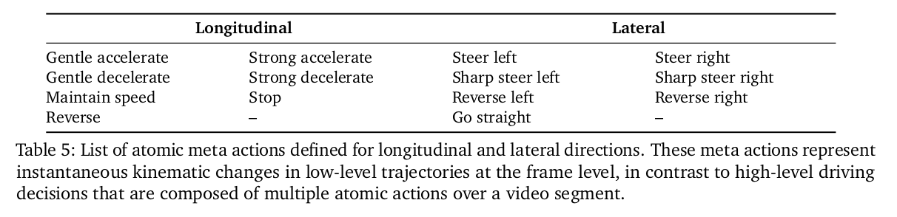

论文中通过自车的运动数据来标注meta-action并确定关键帧的一段描述：

4.3.2. Auto-Labeling

Keyframe Selection for Auto-Labeling. To efficiently scale up training data and enhance model generalization, we develop an auto-labeling pipeline for CoC annotation. To identify keyframes for auto-labeling, we first define a set of low-level meta actions and implement corresponding rule-based detectors to infer these meta actions at the frame level. Then, we treat the frame at which a meta action transition occurs as a decision-making moment, allowing us to determine the keyframe automatically and efficiently across large scale data.

Meta Actions. The complete list of these meta actions is provided in Tab. 5. These low-level meta actions are atomic, representing instantaneous kinematic changes in the ego vehicle’s trajectory, and are therefore distinct from high-level driving decisions. A single high-level driving decision within a video segment typically consists of a sequence of such atomic meta actions across both longitudinal and lateral directions. For example, a left lane-change decision may comprise a sequence of steer left, followed by a brief steer right to stabilize the vehicle heading, and then go straight, often accompanied by a gentle accelerate and maintain speed. For each 8-second data sample, we annotate at most one longitudinal and one lateral high-level driving decision, while atomic meta actions are automatically labeled at 10Hz.

